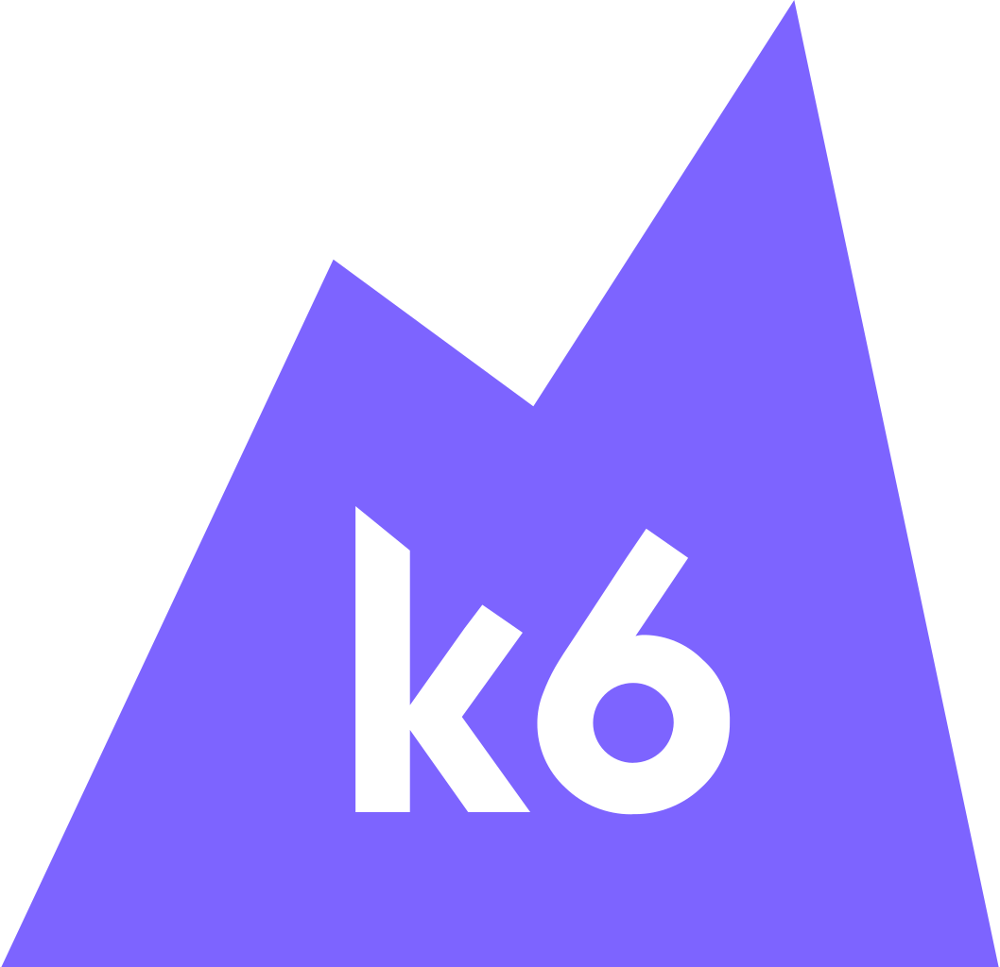

<h1 align="center">
  
</h1>

<!-- Social icons section -->
<!-- <h5 align="center">
  <code>
    <a href="https://www.linkedin.com/in/farhan-labib/" title="LinkedIn Profile"> LinkedIn</a></code>
  <code><a href="https://medium.com/@farhan-labib" title="Medium"> Medium</a></code>
  <code><a href="https://twitter.com/farhan_labib4" title="Twitter Profile"> Twitter</a></code>
  <code><a href="https://www.hackerrank.com/farhan_labib4" title="HackerRank Profile"> HackerRank</a></code>
</h5> -->
<h5 align="center">
  
  
  
  
</h5>

 

  Hi, I'm Farhan Labib, Software Quality Assurance Engineer from Bangladesh
   
   
  🔬 I'm currently working at 10 Minute School
   
  🎓 I graduated from East West University - Computer Science & Engineering Department
   
  💻 I love testing Mobile and Web Apps
   
  📚 I’m currently learning k6, Playwright
   
  📫 How to reach me: <a href="mailto: farhan.labib4@gmail.com">farhan.labib4@gmail.com</a>

### 🔨 Languages and Tools
<h5 align="center">

</h5>

<h2 align="center">⚡ Stats ⚡</h2>
 

  

    <!--  -->
    
  

           
  

    
  

   
  
  

<!--
**farhanlabib/farhanlabib** is a ✨ _special_ ✨ repository because its `README.md` (this file) appears on your GitHub profile.

Here are some ideas to get you started:

- 🔭 I’m currently working on ...
- 🌱 I’m currently learning ...
- 👯 I’m looking to collaborate on ...
- 🤔 I’m looking for help with ...
- 💬 Ask me about ...
- 📫 How to reach me: ...
- 😄 Pronouns: ...
- ⚡ Fun fact: ...
-->
